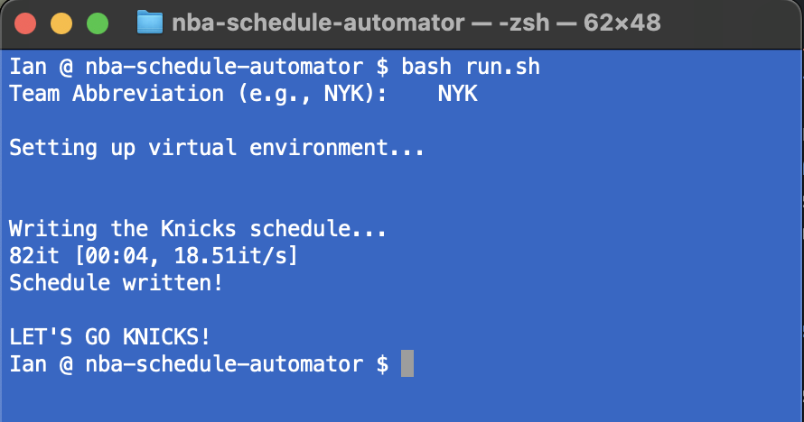
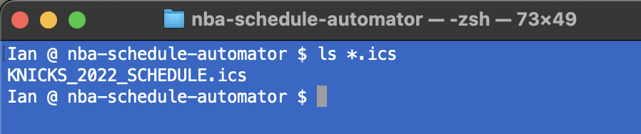

# NBA SCHEDULE AUTOMATOR
 This program automatically generates a .ics file for your favorite team

## Usage Notes

* Most everything is wrapped in `run.sh`
  
* This shell script does the following
  * Creates and sources local virtual environment
  * Installs all dependencies
  * Runs the `NBA_Schedule` wrapper with command line input

* The resulting `.ics` file can be double-clicked and populated in any popular Calendar client (Apple Calendar, GCalendar, etc.)

